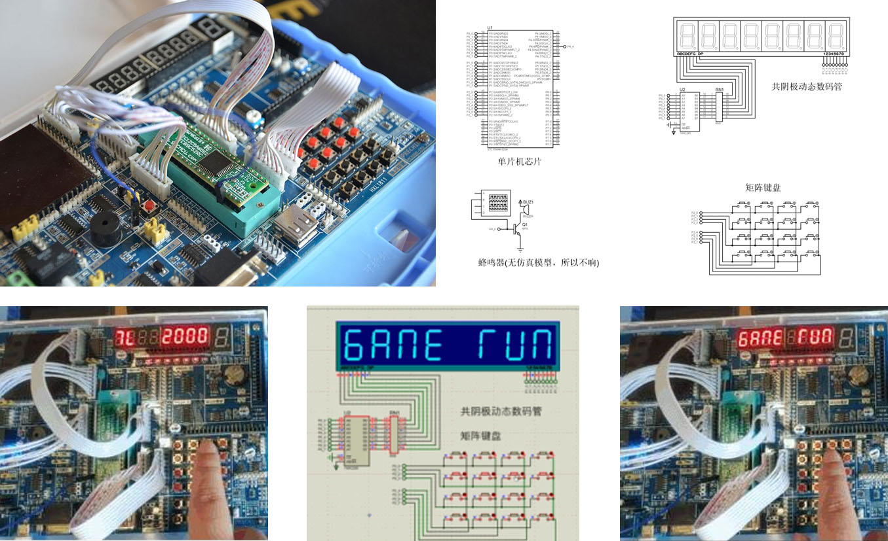

# 项目介绍
打地鼠游戏是一个经典的益智小游戏。本项目将利用IAP15W4K58S4单片机还原这
个游戏场景。这个开源项目来源于一次单片机期末设计作品。

# 目录介绍
./head .h文件目录  
./src .c文件目录  
./doc 设计报告目录

# 图片

# 视频演示
哔哩哔哩：https://www.bilibili.com/video/BV1KE421P7kH

# 项目编译
使用stc-isp程序向Keil软件中添加IAP15W4k58s4单片机头文件，然后使用Keil程序打开项目./打地鼠.uvproj，即可点击编译按钮编译  

# 配套资源
[Proteus仿真电路](https://github.com/heyManNice/IAP15W4K58S4_Whack_a_mole_Proteus8)
